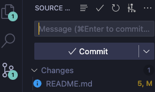

# :fire: NOTICE

## :monocle_face: Git 명령어 입력 순서

1. `git stash`
   작업 중인 코드가 있을 경우 임시로 저장합니다. (변경사항이 없으면 생략해도 됩니다)
2. `git pull origin dev`
   원격 저장소의 dev 브랜치에서 최신 변경사항을 가져옵니다.
3. `git stash apply`
   stash 해두었던 작업 중인 코드를 다시 적용합니다. 이때도 충돌이 발생할 수 있으니 확인 후 해결합니다.
   (1번을 안 했을 경우 6번도 생략)
4. `git add .`
   변경된 파일을 스테이징합니다.
5. `git commit -m “남길 커밋 메세지”`
   변경사항을 커밋합니다.
6. `git push origin 브랜치명`
   작업한 브랜치를 원격 저장소에 푸시합니다.

## Git 주의 사항

- push, pull, merge 등 파일 업로드 및 다운시 한 번에 한 명씩 진행해요.
- Error 및 미완성 코드는 주석 및 stash 처리 후 commit 하기.
- commit 메시지는 컨벤션 형식을 맞춰서 자세하게 적어주기 (한글로 통일)

## Git 사용 문화

- 1일 1회이상 commit, push, merge 하기

## :book: Git 커밋 컨벤션 규칙



```terminal
git commit -m "here"

(ex) git commit -m "rename: apple.html 파일을 orange.html 로 변경했습니다."

```

(ex) 커밋메시지는 꾸미기 나름 입니다. 이모티콘을 넣어도 괜찮아요~~

- 자주 사용하는 태그 종류
  - feat : 새로운 기능을 추가하는 경우
  - fix : 버그를 고친경우
  - docs : 문서를 수정한 경우
  - style : 코드 포맷 변경, 세미콜론 누락, 코드 수정이 없는경우
  - refactor : 코드 리펙토링
  - test : 테스트 코드. 리펙토링 테스트 코드를 추가했을 때
  - chore : 빌드 업무 수정, 패키지 매니저 수정
  - design : CSS 등 사용자가 UI 디자인을 변경했을 때
  - rename : 파일명(or 폴더명) 을 수정한 경우
  - remove : 코드(파일) 의 삭제가 있을 때. "Clean", "Eliminate" 를 사용하기도 함
- 기타 태그 타입들
  - add : 코드나 테스트, 예제, 문서등의 추가 생성이 있는경우
  - Improve : 향상이 있는 경우. 호환성, 검증 기능, 접근성 등이 될수 있습니다.
  - implement : 코드가 추가된 정도보다 더 주목할만한 구현체를 완성시켰을 때
  - move : 코드의 이동이 있는경우
  - updated : 계정이나 버전 업데이트가 있을 때 사용. 주로 코드보다는 문서나, 리소스, 라이브러리등에 사용합니다.
  - comment : 필요한 주석 추가 및 변경
